# 14. Provide User stories for your App.

### Volunteer Stories

- As a bike mechanic, I need to be able to order parts quickly and easily so I have more time to fix bikes and help others learn to fix bikes

- As a unemployed cycling lover I like to volunteer at back2bikes to learn to fix bikes so that I can improve my skills and help the community. I get left alone while parts get ordered on our slow computer when I'd rather have help

### Shop Manager

- As an experienced manager I don't want my process to change too much so I can continue building relationships with customers

- As an experienced manager I dislike our slow ordering process, accessing a slow website on a slow computer as it takes too much time out of my day

- As an experienced manager I find it difficult to explain the price we charge to customers as they can see the wholesale price when we are putting an order through

- As a shop manager, I would like to save parts that need to be ordered throughout a day everyday so I can confirm the order with the wholesaler only once or twice a week at max

- As a shop Manager, I would like to review the order before I confirm it, so I can amend quantity and be able to remove items if they are not needed anymore

- As a shop manager, I would like to be able to quickly distinguish whether I am on searching parts page or reviewing order list so I don't waste my time looking for a parts in the wrong place

- As a shop manager I would like to be able to see the total wholesale price for the order, so that I can see if I am within spending budget

- As a new assistant manager I would like to quickly search for an item using item number and add it to shop ordering cart, so I don't forget to order it later

### back2bikes Owner

- As the owner of the business, I would like to be able to see both the net price and wholesale price within the ordering system, so money in and out can be tracked easily

- As a business we need to earn money to pay our employed manager and cover costs such as delivery and gst so we can continue to survive and grow

### Customer

- As a bike rider I enjoy the quality and friendliness of the back2bikes volunteers but feel like their ordering system is slow and confusing

- As an owner of many bikes I like to get my bikes fixed quickly and cheaply. I get confused when I see on the back2bikes ordering website that a price is $30 but they charge me $60

- As a customer, I would like to see the final price that it will cost me to fix/service my bicycle so I don't have to do any additional calculations myself

- As a customer I like transparent costing so I don't encounter any hidden costs later on

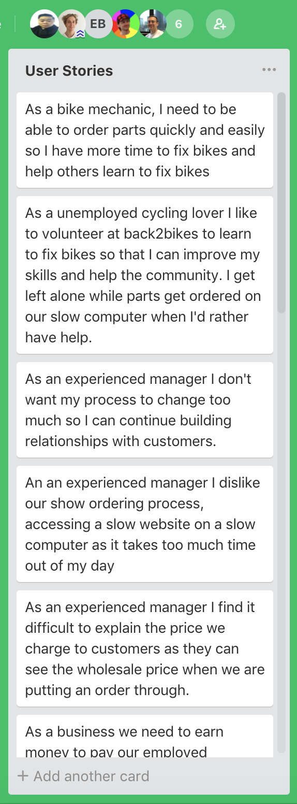

# 16. Provide wireframes for your app.

### Search result with shaded hover-over/add to cart

 

### Card/item components based on current attendance app volunteer cards

 

### Buttons/nav bar component

 

### Other buttons used throughout app

 

### Complete page with list of orders

 

### List of orders - shop view(showing wholesale prices)

 

### Single item view - one card - mobile

 

### Item list/search results - alternative view

 

# 17. Entity Relationship Diagram (ERD)

During the early stages of the project, there have been minor adjustments to the schemas. Taking full advantage of a document database we created at sub-schema for "ordered parts" field which makes scalability more manageable and any changes to be more transparent.

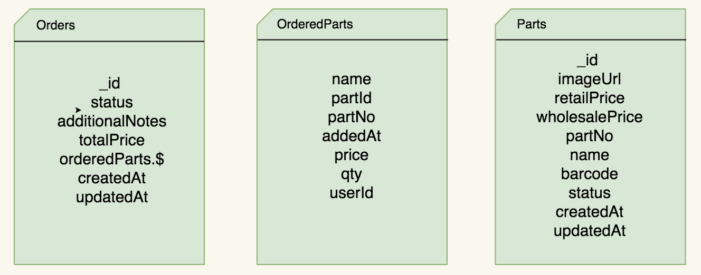

# 19. Trello or similar project management tool to be used for Kanban process to track progress of build

We used Trello and used a specific Trello board layout, as it is used quite extensively in agile software development.

Below are how the lists / columns have been organized:

## Backlog

These are items that need to be done, but perhaps they depend on something like;

* It depends on another card being completed first.
* You have not worked out the details of how to do it.
* It's not in the current sprint, or it's not a high priority.

## Ready

These are items that are ready to go, and have details filled in on the card. Create a checklist of the things that needs to be completed.

## In progress

When you start a task, move the card into "In Progress" and put your name on it. It's best to only have one card for each person in this list - make it a habit to complete a task before grabbing another one.

## Dev done

When you have completed work on the task, create a pull request, update the changelog, and move it to "Dev Done".

Someone other than the dev should review the Pull Request for code quality, ask for changes if needed, and finally approve and merge it

When the PR is merged, it will be moved into QA for someone to test it.

## QA (Quality Assurance)

All items should be tested in the staging environment by someone other than the person who did the work. Someone else will test it differently, and that perspective is useful.

## Done

We move cards to done after it has been through all of the steps above. There are some exceptions, but all development cards will need to go through the process.

Once we have made a release of the software to production, we will archive the cards.

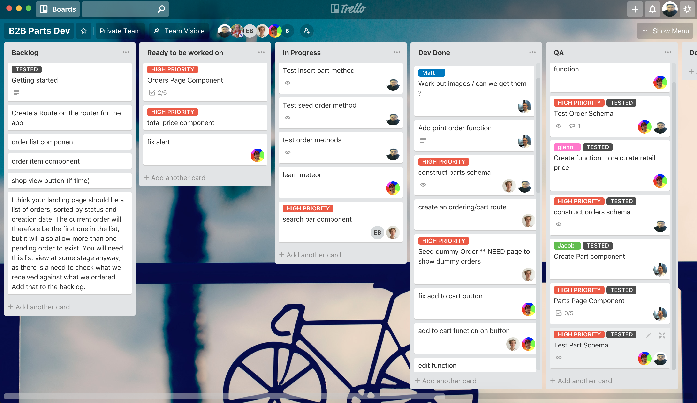

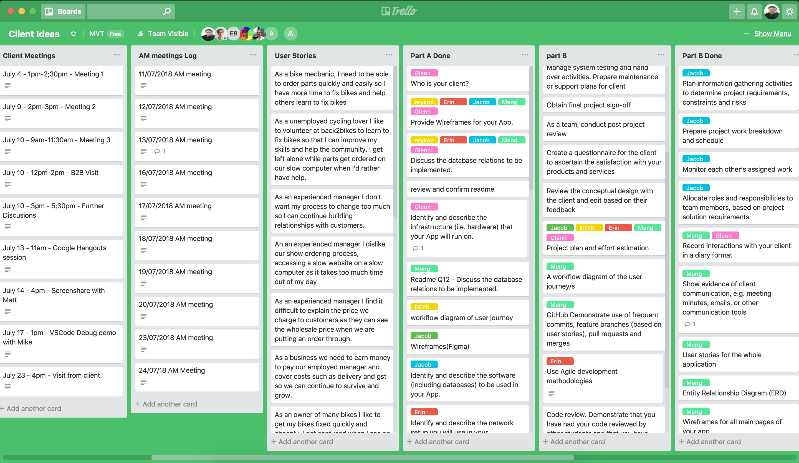

# 20. GitHub Demonstrate use of frequent commits, feature branches (based on user stories), pull requests and merges

#### Back2Bike Git Strategy

Joining Back2Bike's (client) repo, there were house rules we had to comply with and expectations to be met when creating branches, making commits and pull requests. These standards and conventions were communicated through _Nuclino_

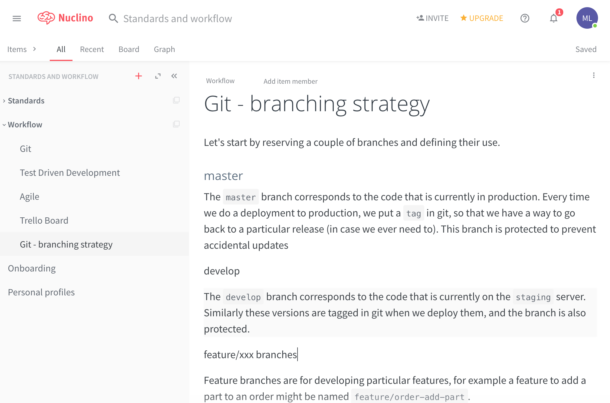

It was a completely different experience joining "someone else's" repo. Naming convention, standards and git strategies that we thought would be acceptable simply were not for the client. It challenged us in a way that we understand how vital it is to name things _meaningful_ and ensures quality control accross the entire repo. 

#### Back2Bike branches

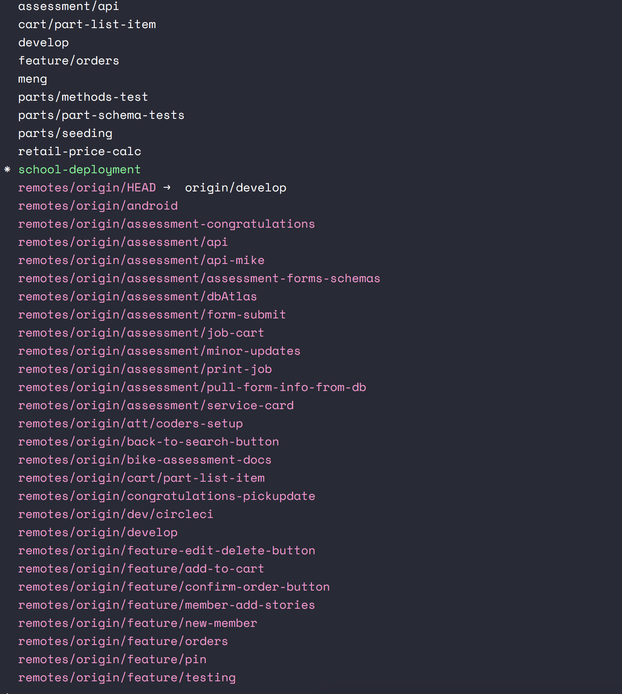

#### Snippets of activity on Github

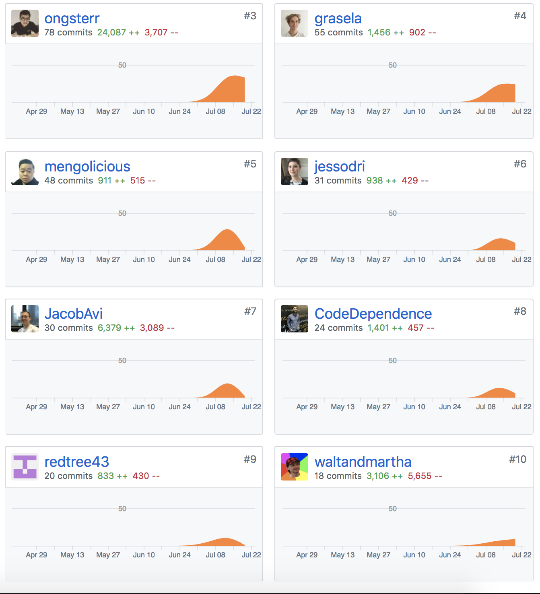

#### Pull Requests

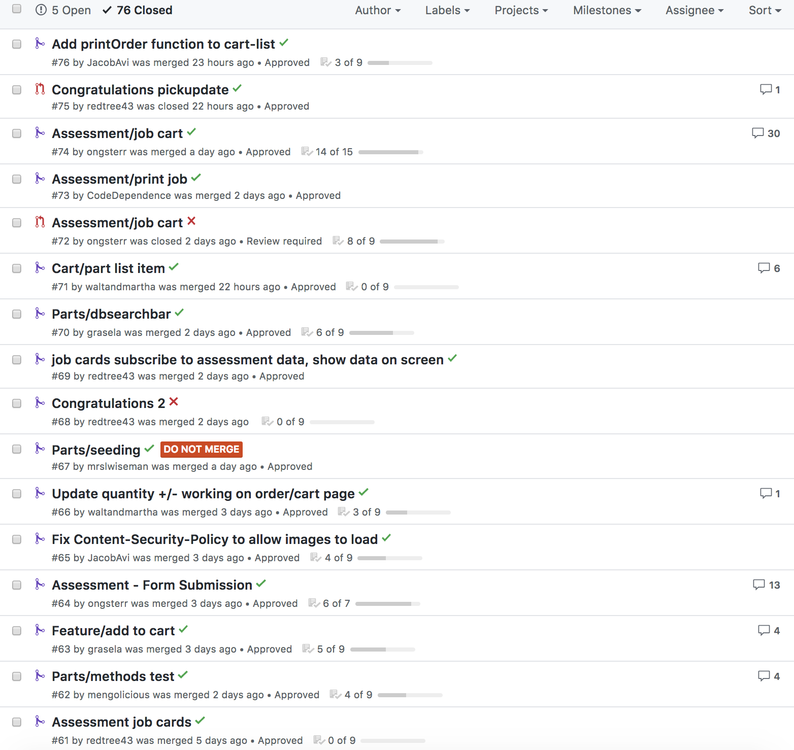

# 23. Show evidence of client communication, e.g. meeting minutes, emails, or other communication tools.

## Slack 
Main tool for communicating with the client was _Slack;_
The client invited our team to their slack channel, we also had our own sub-channel dedicated for the the project.
Slack was the most convenient and well rounded platform for communication.

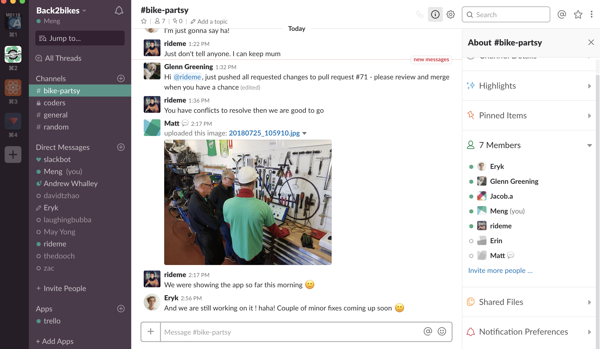

## Google Hangouts 
This was our group's first experience using Google Hangouts, we used it for Video calls and screenshare with the client. 

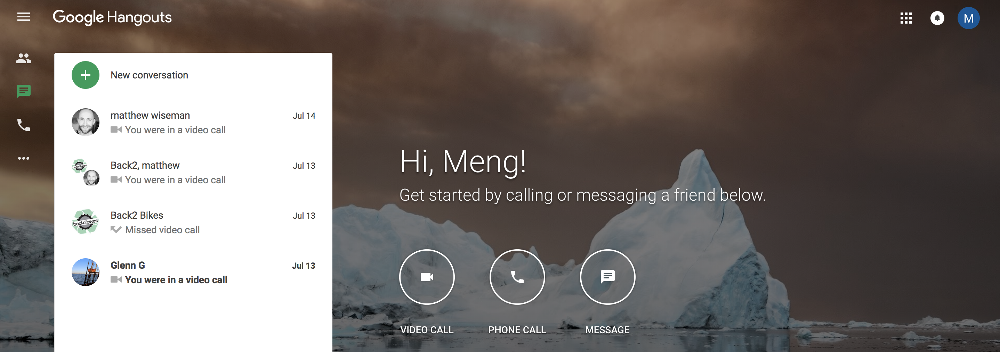

## Face to Face 
* Numerous times we met face to face with the client during the duration of the project. It was really the best method of communication, we took advantage of these meetings to clarify any questions and was an opportunity for the client to mentor us. We all felt grateful that the client was able to meet with us on numerous occassions.

# 1. Record interactions with your client in a diary format

Interactions details with the client were recorded in trello on trello cards which are also available in PDF in a diary format. These diary entries contain details such as:
* Agenda of the meeting
* Brief summary of discussions
* Plans moving forward

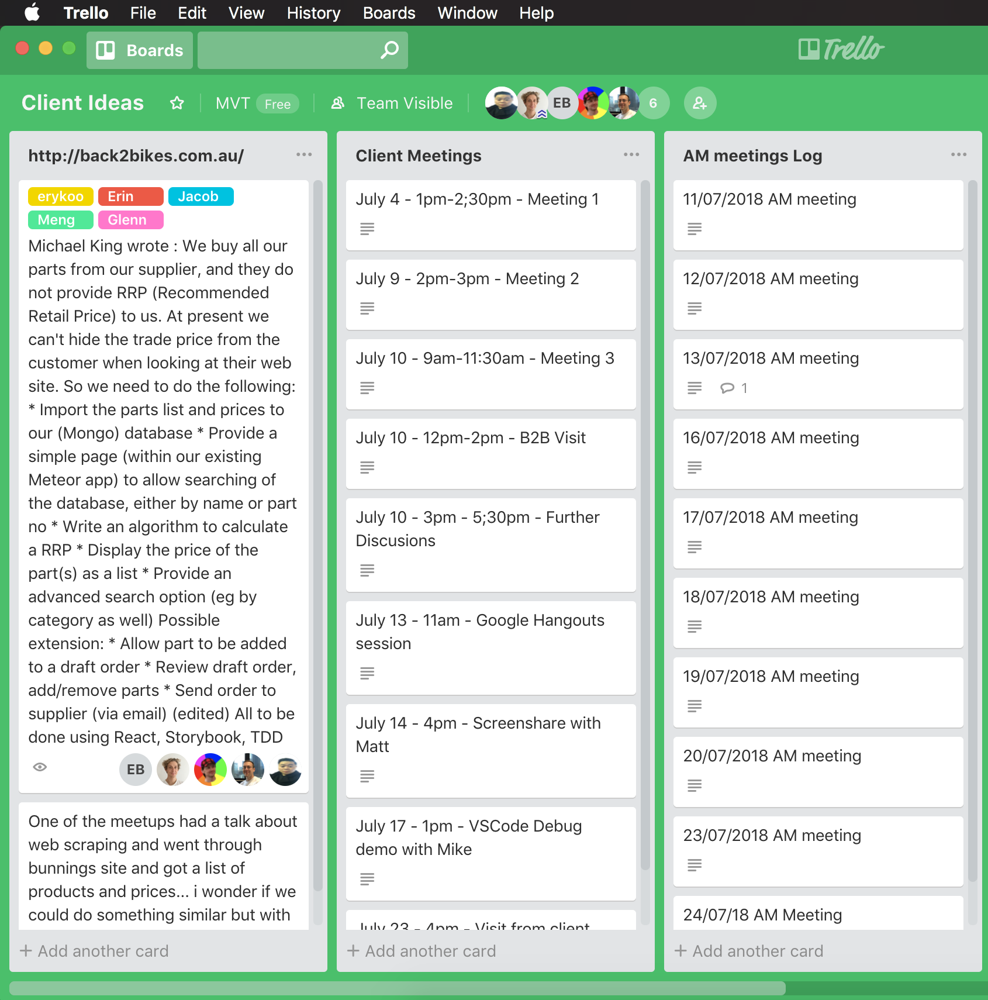
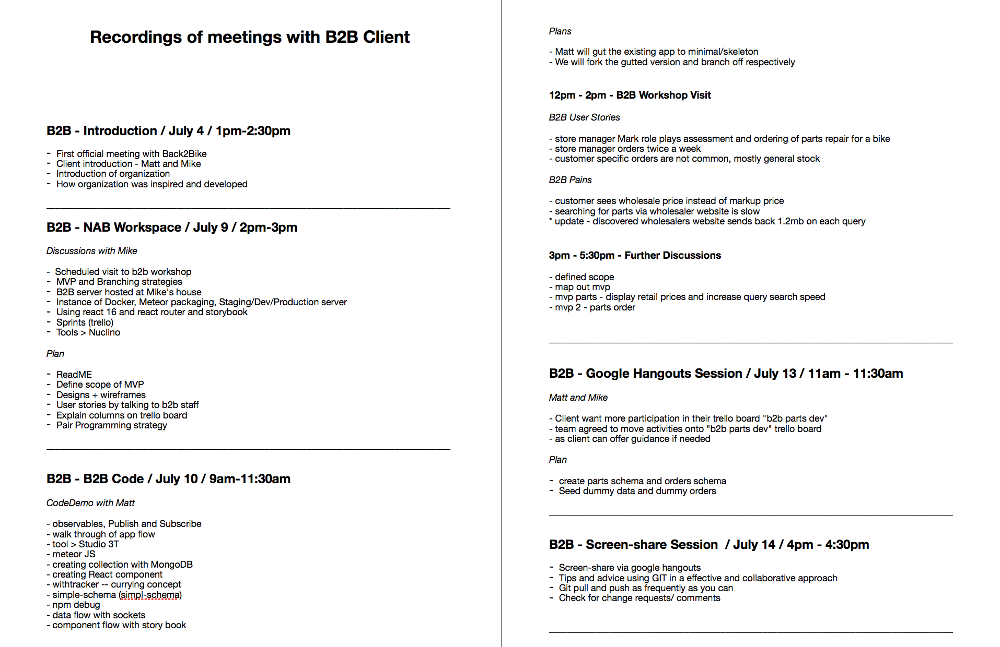

